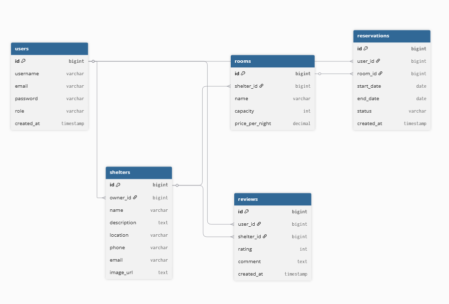

# Projekt bazy danych

## Opis bazy danych

System wykorzystuje relacyjną bazę danych PostgreSQL.

Baza danych odpowiada za przechowywanie:
- użytkowników,
- schronisk,
- pokoi,
- rezerwacji,
- opinii.

# Główne tabele

## users
Tabela przechowuje dane użytkowników systemu.

### Zawiera:
- login,
- email,
- hasło,
- rolę użytkownika,
- datę utworzenia konta.

### Role:
- USER,
- HOST,
- ADMIN.

## shelters
Tabela przechowuje informacje o schroniskach.

### Zawiera:
- właściciela schroniska,
- nazwę,
- opis,
- lokalizację,
- dane kontaktowe,
- zdjęcie.

## rooms
Tabela przechowuje dane pokoi dostępnych w schroniskach.

### Zawiera:
- schronisko,
- nazwę pokoju,
- liczbę miejsc,
- cenę za noc.

## reservations
Tabela przechowuje rezerwacje użytkowników.

### Zawiera:
- użytkownika,
- pokój,
- datę rozpoczęcia i zakończenia pobytu,
- status rezerwacji,
- datę utworzenia.

### Statusy:
- PENDING,
- CONFIRMED,
- CANCELLED.

## reviews
Tabela przechowuje opinie użytkowników.

### Zawiera:
- użytkownika,
- schronisko,
- ocenę,
- komentarz,
- datę dodania opinii.

# Relacje między tabelami

- jeden HOST może posiadać wiele schronisk,
- jedno schronisko może posiadać wiele pokoi,
- jeden użytkownik może posiadać wiele rezerwacji,
- jeden pokój może występować w wielu rezerwacjach,
- jedno schronisko może posiadać wiele opinii.

# Bezpieczeństwo danych

W systemie zastosujemy:
- autoryzację JWT,
- role użytkowników,
- zabezpieczenie endpointów backendowych.

