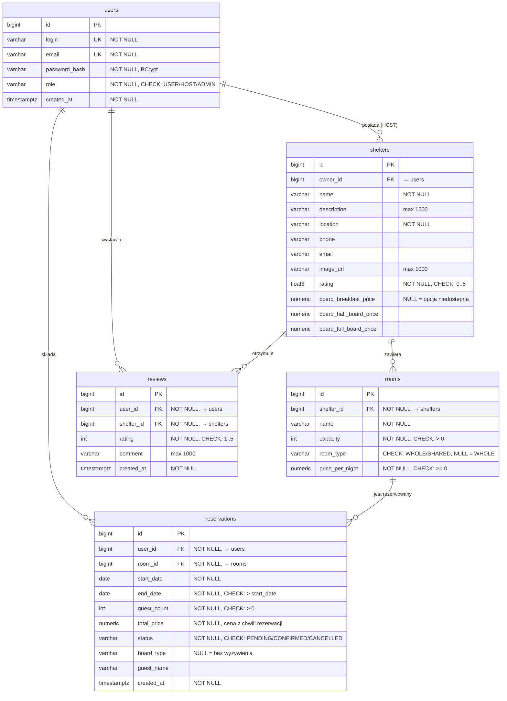

# Projekt bazy danych

## Opis bazy danych

System wykorzystuje relacyjną bazę danych PostgreSQL.

Baza danych odpowiada za przechowywanie:
- użytkowników,
- schronisk,
- pokoi,
- rezerwacji,
- opinii.

# Główne tabele

## users
Tabela przechowuje dane użytkowników systemu.

### Zawiera:
- login,
- email,
- hash hasła (BCrypt - hasło jawne nigdy nie jest przechowywane),
- rolę użytkownika,
- datę utworzenia konta.

### Role:
- USER,
- HOST,
- ADMIN.

## shelters
Tabela przechowuje informacje o schroniskach.

### Zawiera:
- właściciela schroniska,
- nazwę,
- opis,
- lokalizację,
- dane kontaktowe,
- zdjęcie,
- cennik wyżywienia (dopłaty za poszczególne opcje posiłków, ustalane przez właściciela).

## rooms
Tabela przechowuje dane pokoi dostępnych w schroniskach.

### Zawiera:
- schronisko,
- nazwę pokoju,
- liczbę miejsc (pojemność),
- typ pokoju (`WHOLE` / `SHARED`),
- cenę za noc.

### Typy pokoi:
- **WHOLE** (cały pokój) - wynajmowany w całości; jedna rezerwacja blokuje pokój w danym terminie. Cena stała za noc.
- **SHARED** (dormitorium) - miejsca sprzedawane pojedynczo; goście dzielą pokój do wyczerpania pojemności. Cena za noc za każde zajęte miejsce.

## reservations
Tabela przechowuje rezerwacje użytkowników.

### Zawiera:
- użytkownika,
- pokój,
- datę rozpoczęcia i zakończenia pobytu,
- liczbę gości,
- wybraną opcję wyżywienia,
- status rezerwacji,
- datę utworzenia,
- cenę (w momencie stworzenia rezerwacji).

### Statusy:
- PENDING - rezerwacja utworzona, oczekuje na potwierdzenie (płatność),
- CONFIRMED - rezerwacja potwierdzona po kroku płatności,
- CANCELLED - rezerwacja anulowana (przez użytkownika, gospodarza we własnym schronisku lub administratora).

### Opcje wyżywienia:
Gość przy rezerwacji wybiera jedną z opcji posiłków. Dopłata doliczana jest do ceny
za każdego gościa i każdą noc pobytu. Wysokość dopłat **ustala właściciel (HOST)
osobno dla każdego schroniska** przy jego tworzeniu (pola cennika w tabeli `shelters`) -
nie są to wartości stałe w systemie:

- **Bez wyżywienia** - zawsze bez dopłaty,
- **Śniadanie** - dopłata wg cennika schroniska,
- **Śniadanie i kolacja** - dopłata wg cennika schroniska,
- **Pełne wyżywienie** - dopłata wg cennika schroniska.

## reviews
Tabela przechowuje opinie użytkowników.

### Zawiera:
- użytkownika,
- schronisko,
- ocenę,
- komentarz,
- datę dodania opinii.

# Relacje między tabelami

- jeden HOST może posiadać wiele schronisk,
- jedno schronisko może posiadać wiele pokoi,
- jeden użytkownik może posiadać wiele rezerwacji,
- jeden pokój może występować w wielu rezerwacjach,
- jedno schronisko może posiadać wiele opinii.

# Bezpieczeństwo danych

W systemie zastosujemy:
- hashowanie haseł BCrypt (kolumna `users.password_hash`),
- autoryzację JWT,
- role użytkowników,
- zabezpieczenie endpointów backendowych.

# Diagram encji

Aktualny schemat bazy (relacje i ograniczenia - PK, FK, UNIQUE, CHECK):

Wersja graficzna (uproszczona, bez kolumn cennika wyżywienia i typu pokoju):

# Skrypt inicjalizacyjny bazy

Skrypt **`docs/bnabd_init.sql`** zawiera:
- `DROP` istniejących tabel,
- `CREATE` całej struktury wraz z ograniczeniami (PK, FK, UNIQUE, NOT NULL, CHECK).

Uruchomienie: `psql -U bnabd -d bnabd -f docs/bnabd_init.sql`
(utworzenie samej bazy i użytkownika: `docs/setup-local-postgres.sql`).

Skrypt nie jest wykonywany przez aplikację,
schemat generuje Hibernate (`spring.jpa.hibernate.ddl-auto=update`), a dane
przykładowe (użytkownicy testowi z hasłami zahashowanymi BCrypt, schroniska,
pokoje, rezerwacje, opinie) wstawia `DatabaseSeedService` przy starcie backendu.

Administrator z panelu aplikacji może resetować bazę
(`POST /api/admin/db/reset`), to kasuje wszystkie dane w kolejności bezpiecznej
dla kluczy obcych i ponownie sieje dane przykładowe (przez JPA, bez wykonywania skryptu SQL).