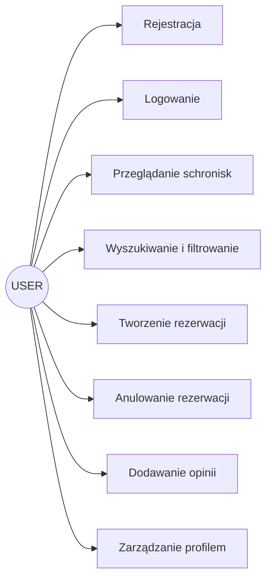
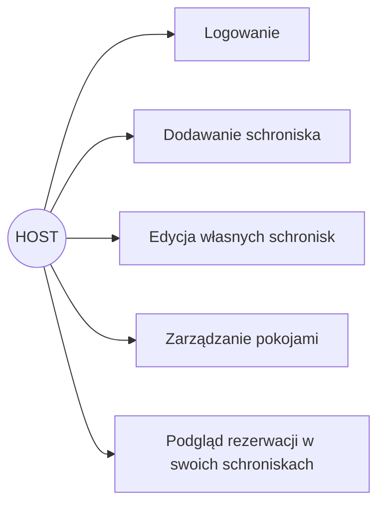
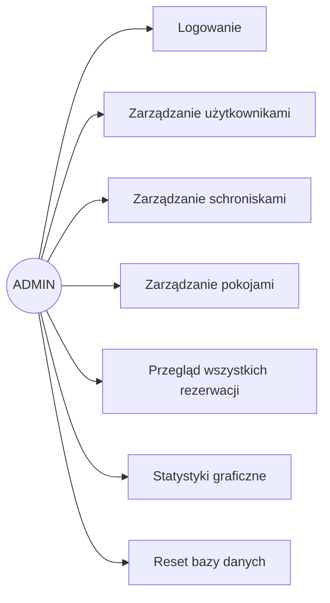
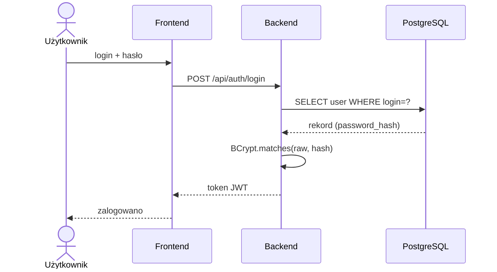
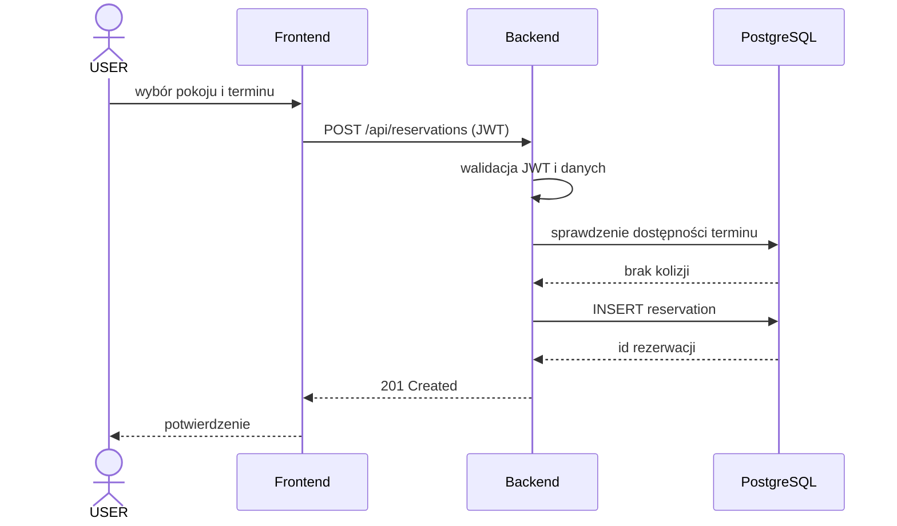

# Role i przypadki użycia

## 1. Role systemowe

System posiada trzy główne role:
- USER
- HOST
- ADMIN

# 2. Rola USER

Użytkownik standardowy może:
- przeglądać schroniska,
- tworzyć rezerwacje,
- anulować rezerwacje,
- dodawać opinie,
- zarządzać profilem.

# 3. Rola ADMIN

Administrator może:
- zarządzać użytkownikami,
- zarządzać schroniskami,
- zarządzać pokojami,
- zarządzać rezerwacjami,
- generować statystyki,
- resetować bazę danych.

# 4. Przypadki użycia użytkownika

## Rejestracja
1. Użytkownik otwiera formularz.
2. Wprowadza dane.
3. System zapisuje konto.

## Logowanie
1. Użytkownik podaje login i hasło.
2. Backend weryfikuje dane.
3. System zwraca token JWT.

## Rezerwacja pokoju
1. Użytkownik wybiera schronisko.
2. Wybiera pokój.
3. Wybiera termin.
4. System zapisuje rezerwację.

# 5. Przypadki użycia administratora

## Dodanie schroniska
1. Administrator otwiera panel admina.
2. Wprowadza dane schroniska.
3. System zapisuje rekord.

## Zarządzanie użytkownikami
1. Administrator przegląda listę użytkowników.
2. Edytuje lub usuwa konto.

# 6. Diagramy UML

## 6.1. Diagram przypadków użycia — USER

## 6.2. Diagram przypadków użycia — HOST

## 6.3. Diagram przypadków użycia — ADMIN

## 6.4. Diagram sekwencji — logowanie

## 6.5. Diagram sekwencji — tworzenie rezerwacji

## 6.6. Diagram encji (ERD)

Diagram encji wraz z relacjami znajduje się w pliku `docs/obraz-1.png`.