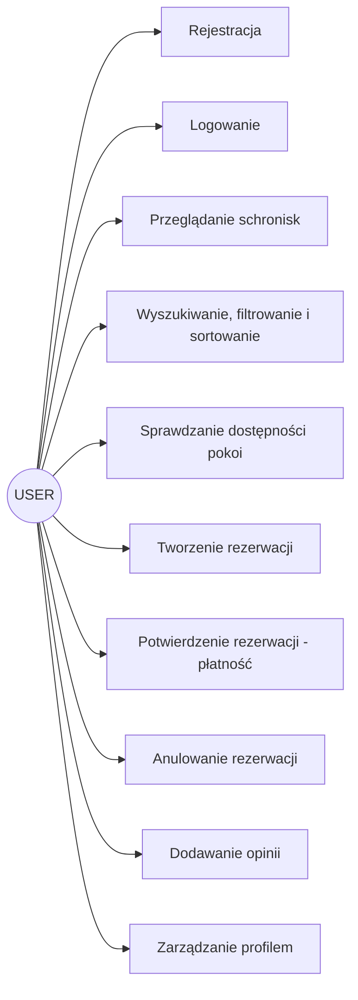
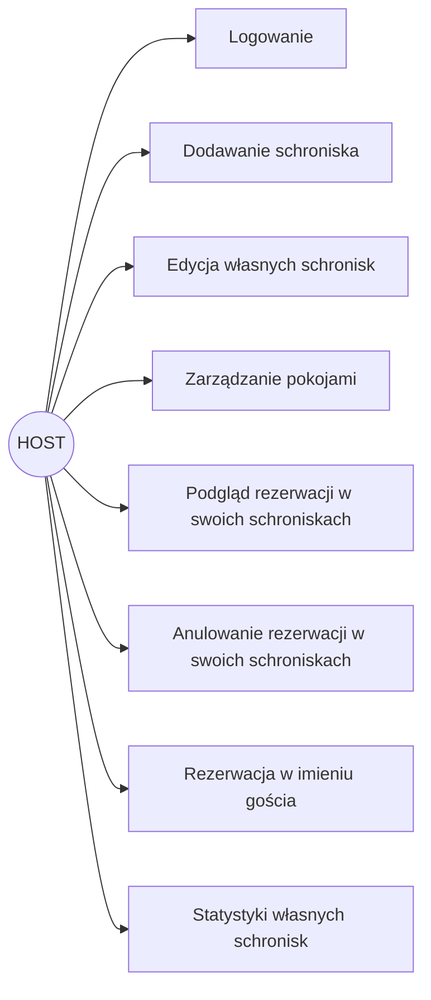
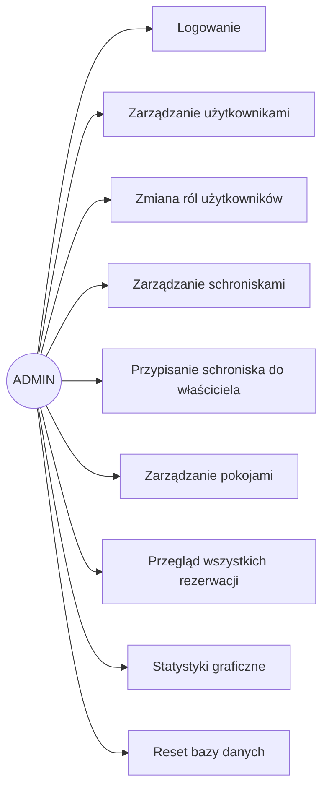
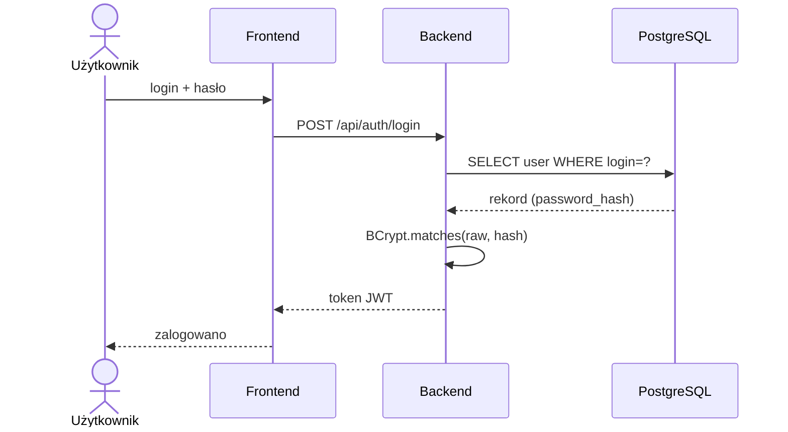
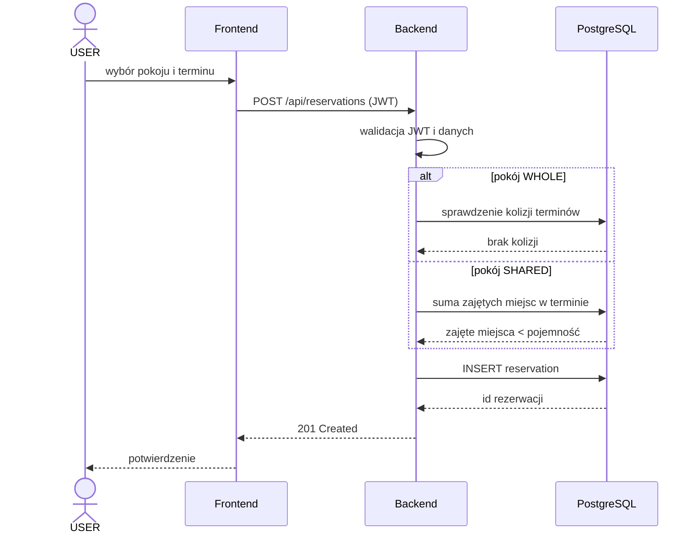
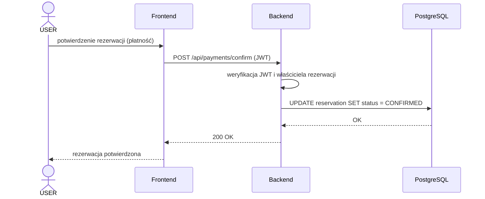

# Role i przypadki użycia

## 1. Role systemowe

System posiada trzy główne role:
- USER
- HOST
- ADMIN

# 2. Rola USER

Użytkownik standardowy może:
- przeglądać schroniska,
- sprawdzać dostępność pokoi w wybranym terminie,
- tworzyć rezerwacje,
- potwierdzać rezerwacje (płatność),
- anulować rezerwacje,
- dodawać opinie,
- zarządzać profilem.

# 3. Rola HOST

Właściciel schroniska (gospodarz) może:
- dodawać własne schroniska,
- edytować dane własnych schronisk (opis, kontakt, zdjęcie, cennik wyżywienia),
- zarządzać pokojami w swoich schroniskach (dodawanie, edycja, usuwanie),
- przeglądać rezerwacje złożone w swoich schroniskach,
- anulować rezerwacje złożone w swoich schroniskach,
- tworzyć rezerwacje w imieniu gościa (z podaniem nazwiska gościa),
- przeglądać statystyki własnych schronisk (liczba rezerwacji, oczekujące, przychód, wykresy miesięczne),
- zarządzać profilem.

# 4. Rola ADMIN

Administrator może:
- zarządzać użytkownikami,
- zmieniać role użytkowników,
- zarządzać schroniskami,
- przypisywać schronisko do innego właściciela (HOST lub ADMIN),
- zarządzać pokojami,
- zarządzać rezerwacjami,
- generować statystyki,
- resetować bazę danych.

# 5. Przypadki użycia użytkownika

## Rejestracja
1. Użytkownik otwiera formularz.
2. Wprowadza dane.
3. System zapisuje konto.

## Logowanie
1. Użytkownik podaje login i hasło.
2. Backend weryfikuje dane.
3. System zwraca token JWT.

## Przeglądanie i sortowanie schronisk
1. Użytkownik otwiera listę schronisk.
2. Opcjonalnie filtruje wyniki po lokalizacji lub frazie wyszukiwania.
3. Wybiera kryterium sortowania (ocena, cena rosnąco/malejąco, nazwa A-Z).
4. System prezentuje posortowaną listę.

## Sprawdzanie dostępności pokoi
1. Użytkownik wybiera schronisko i termin (data początku i końca).
2. System dla każdego pokoju oblicza liczbę wolnych miejsc w tym terminie
   (pokój WHOLE: zajęty lub wolny; pokój SHARED: pojemność minus zajęte miejsca).
3. System prezentuje pokoje z informacją o dostępności.

## Rezerwacja pokoju
1. Użytkownik wybiera schronisko.
2. Wybiera pokój.
3. Wybiera termin, liczbę gości i opcję wyżywienia.
4. System zapisuje rezerwację ze statusem PENDING i ceną wyliczoną w chwili rezerwacji.

## Potwierdzenie rezerwacji (płatność)
1. Użytkownik wybiera rezerwację oczekującą (PENDING).
2. Przechodzi przez krok płatności (placeholder - brak realnego obciążenia).
3. System zmienia status rezerwacji na CONFIRMED.

## Cykl życia rezerwacji
- **PENDING** - rezerwacja utworzona, oczekuje na potwierdzenie (płatność).
- **CONFIRMED** - rezerwacja potwierdzona po kroku płatności.
- **CANCELLED** - rezerwacja anulowana przez użytkownika, gospodarza (we własnym schronisku) lub administratora.

# 6. Przypadki użycia gospodarza (HOST)

## Dodanie schroniska
1. Gospodarz loguje się i otwiera swój panel.
2. Wprowadza dane schroniska (nazwa, opis, lokalizacja, kontakt, zdjęcie, cennik wyżywienia).
3. System zapisuje schronisko przypisane do gospodarza jako właściciela.

## Zarządzanie pokojami
1. Gospodarz wybiera jedno ze swoich schronisk.
2. Dodaje nowy pokój (nazwa, pojemność, typ WHOLE/SHARED, cena za noc) lub edytuje/usuwa istniejący.
3. System zapisuje zmiany.

## Podgląd rezerwacji we własnych schroniskach
1. Gospodarz otwiera listę rezerwacji.
2. System wyświetla rezerwacje dotyczące pokoi w schroniskach należących do gospodarza
   (terminy, liczba gości, status, cena).

# 7. Przypadki użycia administratora

## Dodanie schroniska
1. Administrator otwiera panel admina.
2. Wprowadza dane schroniska.
3. System zapisuje rekord.

## Zarządzanie użytkownikami
1. Administrator przegląda listę użytkowników.
2. Edytuje lub usuwa konto.

# 8. Diagramy UML

## 8.1. Diagram przypadków użycia - USER

## 8.2. Diagram przypadków użycia - HOST

## 8.3. Diagram przypadków użycia - ADMIN

## 8.4. Diagram sekwencji - logowanie

## 8.5. Diagram sekwencji - tworzenie rezerwacji

## 8.6. Diagram sekwencji - potwierdzenie rezerwacji (płatność)

## 8.7. Diagram encji (ERD)

Aktualny diagram encji wraz z relacjami i ograniczeniami znajduje się
w `docs/03_baza_danych.md` (diagram Mermaid); wersja graficzna w `docs/obraz-1.png`.